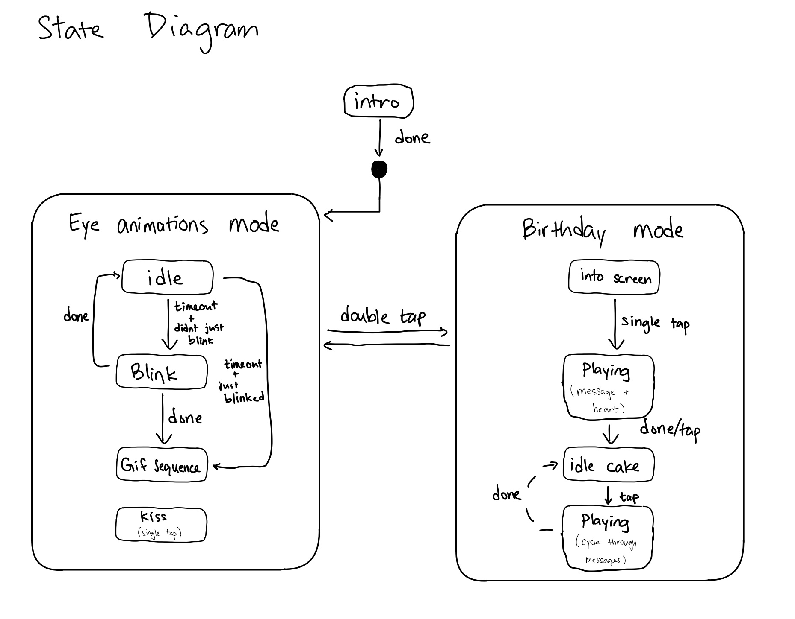
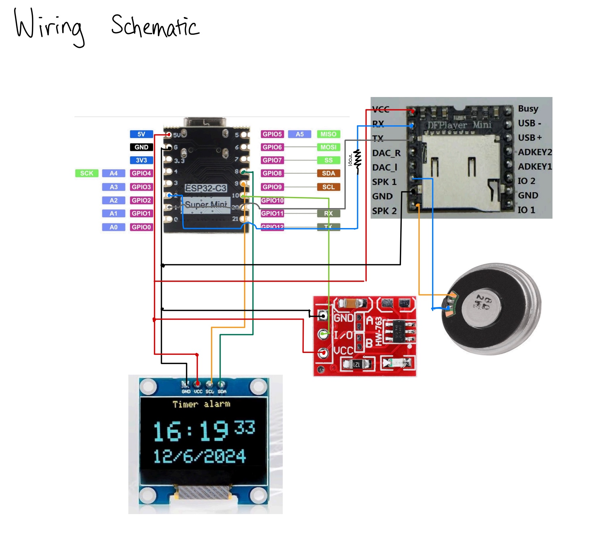

**Birthday Bot**

This is a tabletop device built on an ESP32-C3 Super mini featuring an animated OLED display, personalized birthday messages from family members, touch interface, and a custom 3D-printed enclosure.

This is a gift to my mom.

---

## Demo

Coming soon..

---

## Features

- **Animated OLED gifs** — idle blinking, expressions (smirk, yawn, snooze, laser, kiss), and a boot intro sequence, all driven by bitmap frame arrays
- **Birthday message mode** — cycles through 7 personalized audio recordings, one per family member, with a pulsing heart and sender name on screen
- **Capacitive touch input** — single tap triggers animations or advances messages; double tap switches between the two system modes
- **DFPlayer Mini audio** — plays MP3s from a microSD card with per-message volume control
- **3D-printed enclosure** — custom housing designed to fit the perfboard assembly

---

## How It Works

The device runs two top-level modes, switchable at any time with a double tap.

### GIF animations mode (default)
The OLED displays an idle blinking face. After a timeout it cycles through a sequence of animated GIF-style expressions stored as bitmap frame arrays. A single tap triggers a kiss animation with a chime sound.

### Birthday mode
A lovely greeting filled with hearts with a text box telling the user to tap. Each tap plays an audio message from a different family member while showing their name and a pulsing heart. After the track ends, a pixel-art birthday cake appears with a typewriter prompt to continue. Messages loops through all family members.

### Touch logic
Single tap and double tap are distinguished using a deferred detection window (350 ms). This avoids false double-tap triggers while keeping response feel snappy.

---

## State Diagram



---

## Hardware

| Component | Details |
|---|---|
| Microcontroller | ESP32-C3 Super Mini |
| Display | 0.96" I2C OLED Display |
| Audio module | DFPlayer Mini |
| Touch sensor | TTP223 Capacitive Touch Switch |
| Storage | 16GB TF from facebook marketplace  |
| Enclosure | Custom 3D-printed PLA housing |
---

## Wiring



| ESP32 Pin | Connected To |
|---|---|
| GPIO 8 (SDA) | OLED SDA |
| GPIO 9 (SCL) | OLED SCL |
| GPIO 1 (TX) | DFPlayer RX |
| GPIO 2 (RX) | 100 ohm resistor + DFPlayer TX |
| GPIO 10 | TTP223 touch output |
| 3.3V / GND | All modules |

---

## SD Card Setup

The DFPlayer Mini reads MP3s by folder and track number, so the card is structured like this:

```
/mp3/
  0001.mp3   → boot jingle
  0002.mp3   → kiss sound / eye mode ambient
  0003.mp3   → birthday mode entry sound
  0004.mp3   → message from Family member 1
  0005.mp3   → message from Family member 2
  0006.mp3   → message from Family member 3
  0007.mp3   → message from Family member 4
  0008.mp3   → message from Family member 5
  0009.mp3   → message from Family member 6
  0010.mp3   → message from Family Pet
```

## 3D-Printed Enclosure

> STL files are in `/hardware/housing.stl`
> Printed in PLA at 0.1mm layer height. Designed in Autodesk Fusion.

---

## Acknowledgements

The OLED eye animation framework is based on [esp32_dasai_mochi_clone_and_how_to](https://github.com/huykhoong/esp32_dasai_mochi_clone_and_how_to) by [huykhoong](https://github.com/huykhoong), which provided the bitmap frame rendering approach for the SSD1306 display.

My additions:
- DFPlayer Mini audio module integration with per-message volume control
- TTP223 capacitive touch sensor with single/double-tap detection
- Birthday mode with 7 personalized family message tracks
- Animated birthday intro screen (rising hearts, typewriter prompt, pixel cake)
- Dual-mode system architecture with runtime switching
- Custom 3D-printed enclosure

---